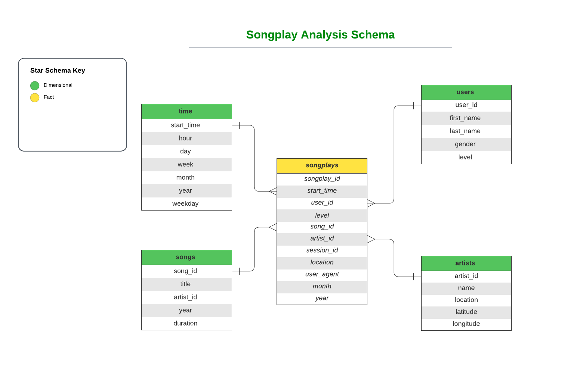
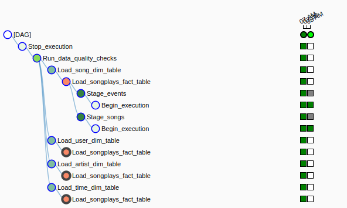

# Project: Data Pipelines with Airflow 

A music streaming company, Sparkify, has decided that it is time to introduce more automation and monitoring to their data warehouse ETL pipelines and come to the conclusion that the best tool to achieve this is Apache Airflow.

The main role is to create high grade data pipelines that are dynamic and built from reusable tasks, can be monitored, and allow easy backfills. It is also noted that the data quality plays a big part when analyses are executed on top the data warehouse and want to run tests against their datasets after the ETL steps have been executed to catch any discrepancies in the datasets.

The source data resides in S3 and needs to be processed in Sparkify's data warehouse in Amazon Redshift. The source datasets consist of JSON logs that tell about user activity in the application and JSON metadata about the songs the users listen to.

## Technologies Used
- AWS S3 (where the source data resides) 
- AWS Redshift
- Apache Airflow
- PostgreSQL

## Schema Design

### The pipeline is established using the star schema data model below:

 
 

## General Instructions:
- The data bucket in `S3` uses the `us-west-2` time region which has to match the cluster used in Redshift.
- In order to connect Redshift and Postgres to Airflow, the connections should be created and configured with Airflow UI.
- Query Editor is used in Redshift to create the tables wherein the data is staged and modeled.

 
 

## Creating Sparkify Database and Tables

- In Redshift's Query Editor, run the SQL statements in `create_tables.sql` to create the tables with specific columns.

 
 

## Database ETL Pipeline
- The main DAG that runs, schedules and monitors the pipeline should look like this:

- Four custom operators are made to suit the requirements which are staging the data from S3 into Redshift, loading the fact and dimension table, and checking the data quality
- Airflow hooks are used in the operators to pass the connection configurations into the pipeline.
- A helper class `SqlQueries` is imported to query the data from the staging tables and make the insertions into the analytics tables.
- All the SQL queries in the project are implemented dynamically using params, not hard-coded to the operators.
- The DAG can pipeline runs and can be browsed as follows:

## Instructions
- DAG contains default_args dict, with the following keys:
    - `Owner`
    - `Depends_on_past : False`
    - `Start_date`
    - `Retries : 3`
    - `Retry_delay : timedelta(minutes=5)`
    - `Catchup : False`

- DAG initialization parameters to be added:
    - `max_active_runs=1` (one task per DAG running)
    - `schedule_interval='0 * * * *'` (DAG scheduled to run once an hour)

 

- In the `stage_events` phase, the copy statement is formated as per the json file in the following path: `'s3://udacity-dend/log_json_path.json'`
- The DAG allows to switch between append-only and delete-load functionality in either `LoadFact` operator or `LoadDimension`.
- In `DataQualityCheck` operator, the DAG either fails or retries n times.

